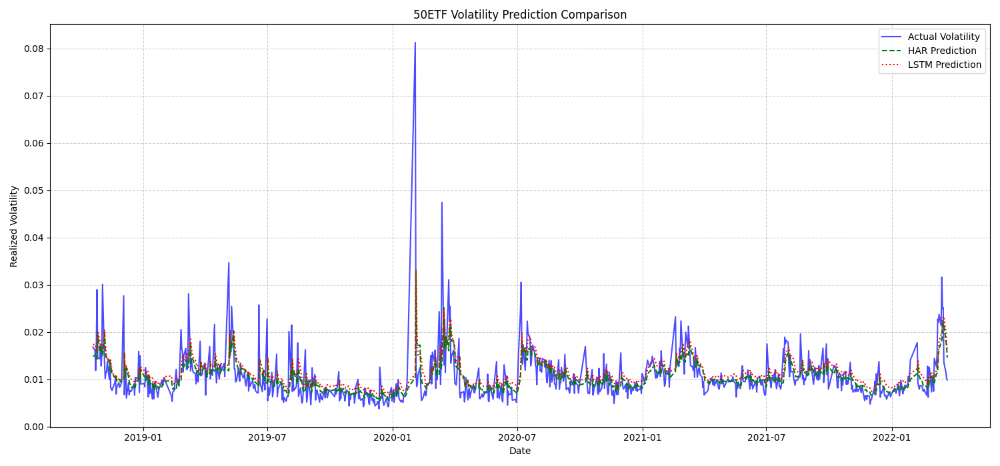

# LSTM_Predict_Vol
Replicate the study 'Can LSTM outperform volatility-econometric models?' with SSE 50 etf
[English](#english) | [中文](#中文)
  
---


<a name="english"></a>

# Realized Volatility Prediction using HAR and LSTM Models

This project aims to reproduce the core ideas from the paper "Can LSTM outperform volatility-econometric models?" by applying them to the minute-level high-frequency data of the SSE 50 ETF. It provides a comparative analysis between a classic econometric model (HAR-RV) and a deep learning model (LSTM) for predicting daily realized volatility.

## ✨ Features

- **Data Processing**: Implements a complete workflow for calculating daily Realized Volatility from high-frequency, minute-level data.
- **Model Implementation**: Contains full implementations of both the classic HAR-RV model and an LSTM model based on TensorFlow/Keras.
- **Interactive Visualization**: Generates interactive charts using Plotly, allowing for detailed exploration and analysis of the prediction results.
- **Modular Code**: The code is structured cleanly, making it easy to understand and extend.

## 📂 File Structure

```
.
├── 50ETF_1min.csv          # Raw minute-level data
├── volatility_prediction.py # Main script
├── requirements.txt        # Project dependencies
├── interactive_prediction_comparison.html  # Generated interactive chart (combined)
├── subplots_prediction_comparison.html     # Generated interactive chart (subplots)
├── prediction_comparison.png               # Generated static chart
└── README.md               # This file
```

## 🚀 How to Run

1.  **Clone the Repository**
    ```bash
    git clone [YOUR_REPOSITORY_URL]
    cd [YOUR_PROJECT_FOLDER]
    ```

2.  **Create and Activate a Virtual Environment**
    ```bash
    # Create the environment
    python3 -m venv venv
    # Activate on macOS/Linux
    source venv/bin/activate
    # Activate on Windows
    .\venv\Scripts\activate
    ```

3.  **Install Dependencies**
    ```bash
    pip install -r requirements.txt
    ```

4.  **Run the Script**
    ```bash
    python volatility_prediction.py
    ```
    After execution, the script will automatically generate `*.png` and `*.html` chart files in the folder.

## 📊 Experimental Results

This project was backtested on the SSE 50 ETF data from 2005 to 2022. The performance metrics of the two models on the test set are as follows:

- **HAR-RV Model**: MSE = 0.000020, MAE = 0.002487
- **LSTM Model**: MSE = 0.000021, MAE = 0.002869

The results indicate that the classic HAR-RV model slightly outperformed the baseline LSTM model in this experiment. This aligns with the original paper's conclusion that deep learning models require careful fine-tuning to surpass strong benchmarks.

**Prediction Results Comparison Chart:**


## 📚 References

- Rodikov, G., & Antulov-Fantulin, N. (2022). *Can LSTM outperform volatility-econometric models?*. arXiv preprint arXiv:2202.11581.

---

<a name="中文"></a>

# 基于HAR与LSTM模型的已实现波动率预测

本项目旨在复现论文《Can LSTM outperform volatility-econometric models?》中的核心思想，通过使用上证50ETF的分钟级高频数据，对比分析了经典的计量经济学模型（HAR-RV）与深度学习模型（LSTM）在预测日度已实现波动率方面的表现。

## ✨ 项目特点

- **数据处理**：实现了从分钟级高频数据计算日度已实现波动率（Realized Volatility）的完整流程。
- **模型实现**：包含了经典的HAR-RV模型和基于TensorFlow/Keras的LSTM模型的完整实现。
- **结果可视化**：使用Plotly生成了可交互的预测结果对比图表，方便对模型细节进行缩放和分析。
- **模块化代码**：代码结构清晰，易于理解和扩展。

## 📂 文件结构

```
.
├── 50ETF_1min.csv          # 原始分钟级数据
├── volatility_prediction.py # 主代码文件
├── requirements.txt        # 项目依赖库
├── interactive_prediction_comparison.html  # 生成的合并交互图
├── subplots_prediction_comparison.html     # 生成的堆叠交互图
├── prediction_comparison.png               # 生成的静态结果图
└── README.md               # 本说明文件
```

## 🚀 如何运行

1.  **克隆代码库**
    ```bash
    git clone [您的代码库URL]
    cd [您的项目文件夹]
    ```

2.  **创建并激活虚拟环境**
    ```bash
    # 创建
    python3 -m venv venv
    # 激活 (macOS/Linux)
    source venv/bin/activate
    # 激活 (Windows)
    .\venv\Scripts\activate
    ```

3.  **安装依赖**
    ```bash
    pip install -r requirements.txt
    ```

4.  **运行脚本**
    ```bash
    python volatility_prediction.py
    ```
    脚本运行后，会自动在文件夹内生成`*.png`和`*.html`的结果图表文件。

## 📊 实验结果

本项目在2005年至2022年的上证50ETF数据上进行了回测。在测试集上，两个模型的性能指标如下：

- **HAR-RV 模型**: MSE = 0.000020, MAE = 0.002487
- **LSTM 模型**: MSE = 0.000021, MAE = 0.002869

**预测结果对比图:**


从结果来看，经典的HAR-RV模型在本次实验中的表现略优于基准的LSTM模型，这与原论文中“深度学习模型需要精细调参才能超越强基准”的结论相符。

## 📚 参考文献

- Rodikov, G., & Antulov-Fantulin, N. (2022). *Can LSTM outperform volatility-econometric models?*. arXiv preprint arXiv:2202.11581.
